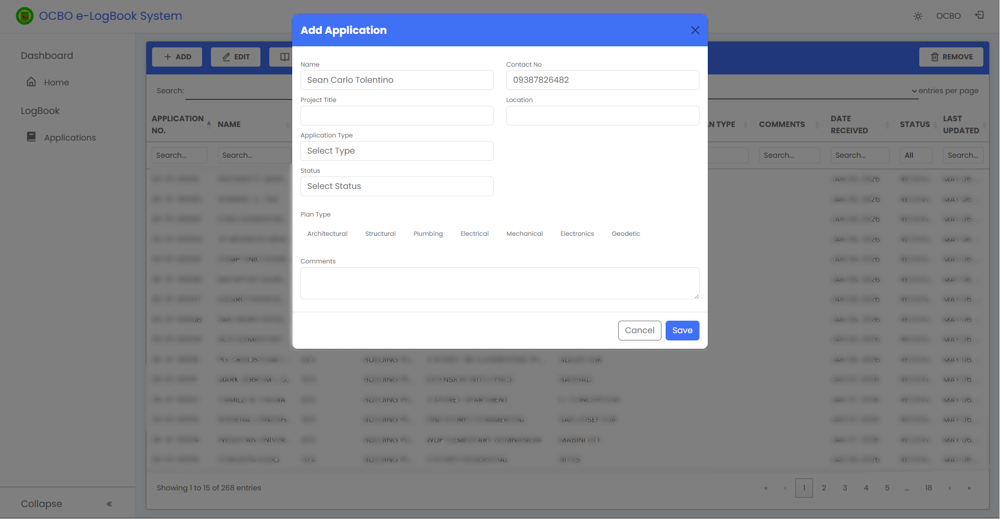
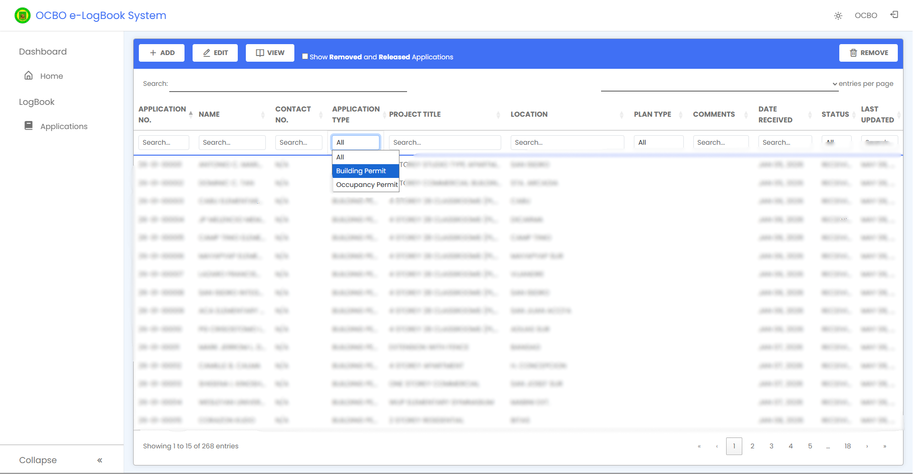
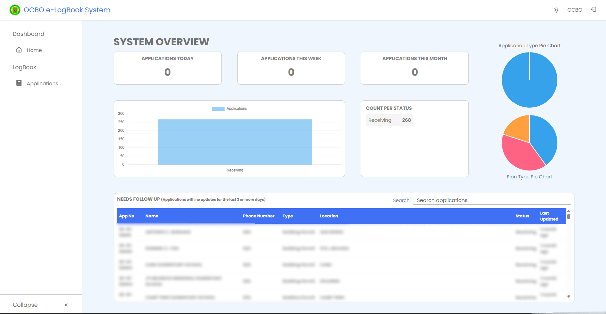

<h1 align="center">
📒 Cabanatuan City LGU - Office of the City Building Official Logbook System 
</h1>

  

  
  
  
  

---

## 📌 Overview

The **OCBO Logbook System** is a web-based application designed to digitize the manual logbook process used by the Office of the City Building Official.

It replaces handwritten logs with a centralized system for recording, tracking, and managing office transactions efficiently and securely.

---

## 🎯 Problem Statement

The traditional logbook system had several issues:

- Time-consuming manual encoding of entries  
- Difficulty searching past records  
- Risk of lost or damaged logbooks  
- Lack of centralized data storage  

---

## 💡 Solution

A digital logbook system that allows:

- Fast encoding of office transactions  
- Searchable and organized records  
- Secure centralized database  
- Improved tracking of daily activities  

---

# ✨ Features

## 📝 Digital Logbook Entry

- Encode daily transactions
- Timestamped records
- Organized entry categories

  

---

## 🔍 Search & Filtering

- Search by name, date, or transaction type  
- Filter records efficiently  
- Quick access to past logs  

  

---

## 📊 Reports Module

- Daily log reports  
- Monthly summaries   

  

---

## 🔐 Security Features

- Password hashing  
- Session authentication  
- Input validation

---

# 🛠 Technology Stack

## Frontend
- HTML5  
- CSS3  
- Bootstrap  
- JavaScript  
- jQuery  

## Backend
- PHP  

## Database
- MySQL  

## Tools
- AJAX  
- Git & GitHub  
- XAMPP  

---

# 📈 Project Impact

The system improved office operations by:

- Reducing manual encoding time  
- Improving record accessibility  
- Preventing data loss  
- Enhancing reporting efficiency  
- Centralizing transaction history  

---

Built using PHP, MySQL, Bootstrap, and jQuery

